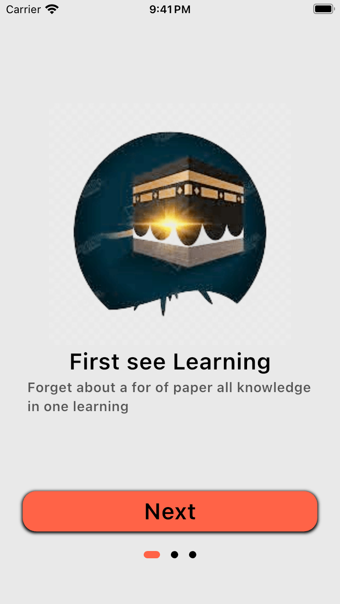
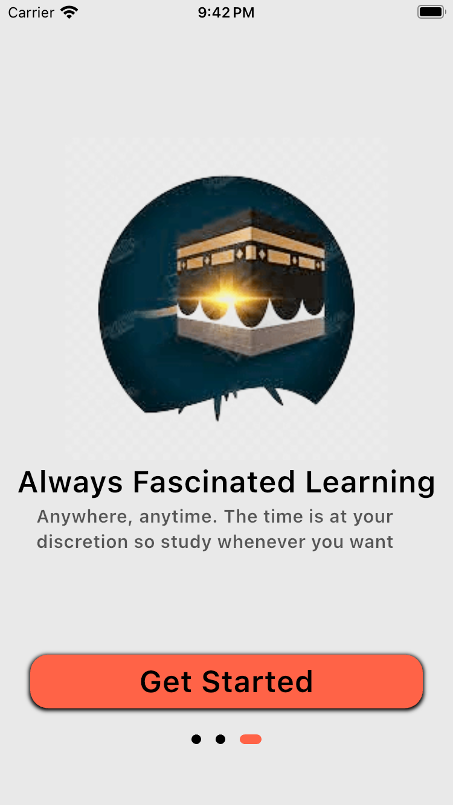
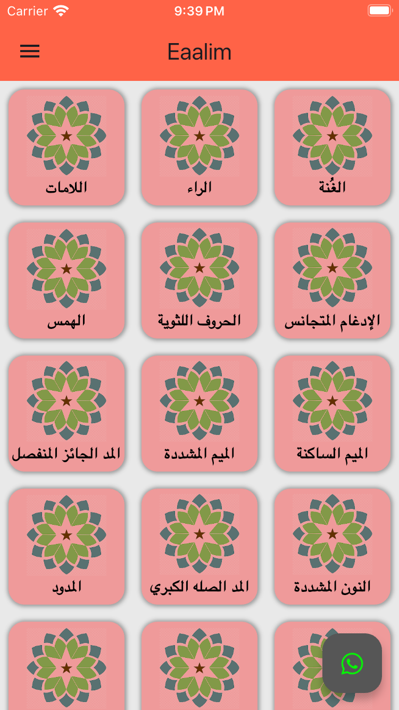
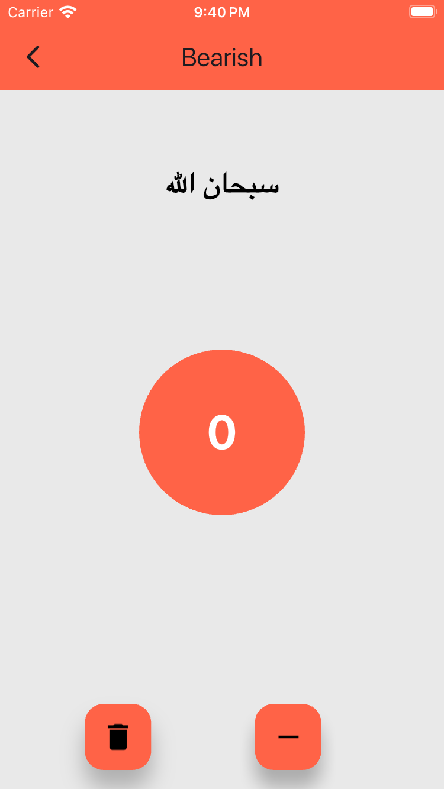
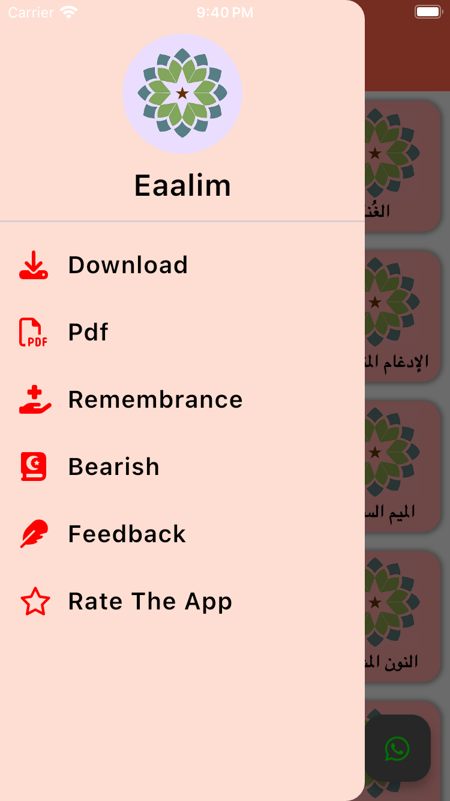
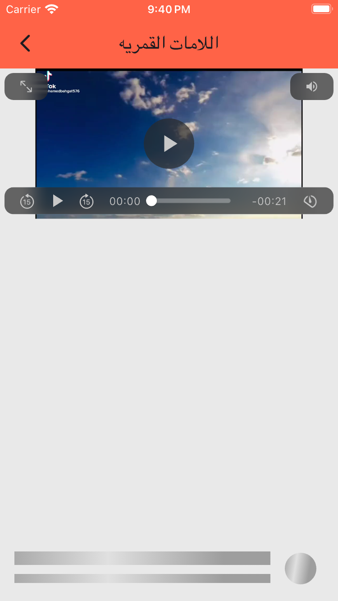
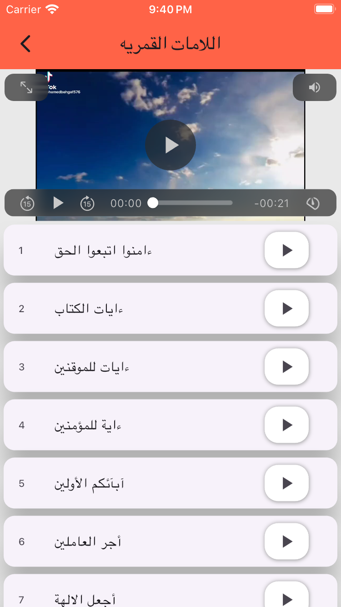

<p align="center">
  
</p>

<p align="center">
  
  
  
</p>

---

## 🌟 Features
- 🕌 **Quran Reader**: Multiple fonts, translations, and audio playback.
- 📿 **Sebha Tracker**: Digital prayer counter with customizable designs.
- 🎧 **Audio Player**: Recitations by famous Shaykhs.
- 📺 **Video Player**: Video recitations by famous Shaykhs.

---

## 🎥 App Preview
<!-- Replace with your GIFs later -->
<p align="center">
  
  
  
  
  
  
  
  
</p>

---

## 🛠️ Tech Stack
```dart
- Flutter & Dart
- State Management: Bloc Pattern
- Audio: JustAudio, AudioService
```
